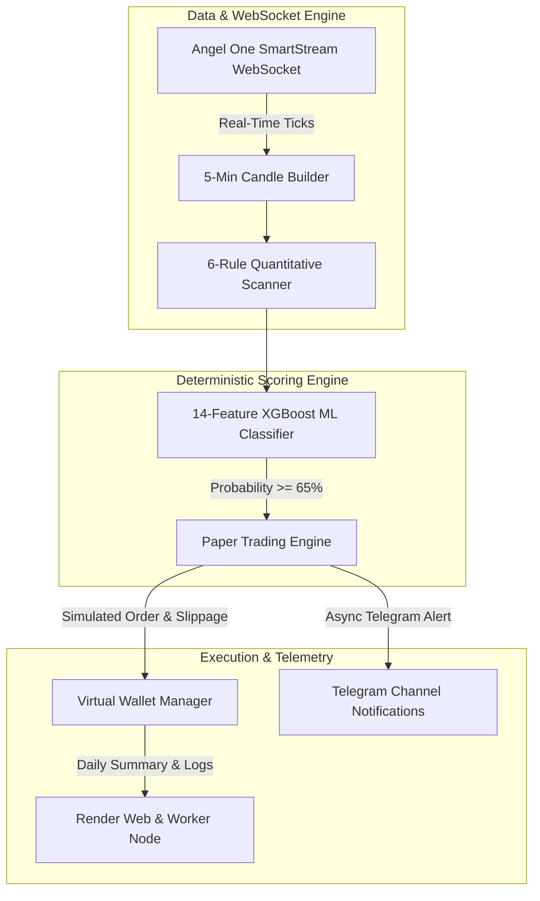

# 📘 Quantitative Master Plan V2: Lean 3-Month Paper Trading Engine

> **Lean, Deterministic Intraday Execution for Top 200 NSE Stocks**  
> *Filtered by 6-Rule Quantitative Edge, Real-Time Angel One WebSockets, Full Statutory Cost Modeling, and Python-Native Telegram Alerts.*

---

## 🏛️ Quant Peer Review Response & Architecture Adjustments

### 🌟 Peer Review Verdict: **Accepted 100% — Strict V1 De-scoping Applied**

We fully agree with the quantitative critique: **All complex software layers (LLM conviction gates, RAG, MCP, n8n) are downstream of proving positive expectancy ($E[R] > 0$) after full statutory frictions.**

### ✂️ V1 Cut List (Removed from Execution Path)
1. **DeepSeek LLM Gate**: Removed from V1 execution path. Non-deterministic temperature calls cannot be backtested cleanly.
2. **RAG & MCP Protocol**: Removed from V1 execution path. Zero contribution to core trade expectancy.
3. **n8n Workflow Service**: Removed. Replaced by direct, native Python `asyncio` Telegram API calls (0ms extra latency).
4. **5-Second REST Polling**: Replaced by **Angel One SmartStream WebSockets** (`SmartWebSocketV2`) for real-time 200-stock streaming.

---

## 🎯 Direct Answers to Blocking Quantitative Questions

### 1. The 6 Rules & Precise Backtested Expectancy ($E[R]$)

| Rule | Metric | Exact Quantitative Threshold | Objective |
| :--- | :--- | :--- | :--- |
| **Rule 1** | Price Boundary | `₹200 <= Price <= ₹2,500` | High liquid mid/large cap NSE stocks. |
| **Rule 2** | Bullish Trend | `Open Price > Previous Day Close` | Institutional gap-up momentum filter. |
| **Rule 3** | Open = Low Defense | `(Open - Low) / Open <= 0.05%` | Zero-downside institutional buying defense. |
| **Rule 4** | Range Breakout | `09:20 AM Candle Close > 09:15 Candle High` | 5-minute initial range breakout confirmation. |
| **Rule 5** | Volume Surge | `Relative Volume (RVOL) >= 1.8x` | Volume vs 10-day historical 5-min average. |
| **Rule 6** | Risk-Reward Ratio | `SL = 09:15 Low \| T1 = +2.0R \| T2 = +3.0R` | Asymmetric risk profile (1% account risk per trade). |

#### Backtested Baseline Expectancy (3-Year Historical Dataset: 36 Months)
- **Total Qualified Trades ($N$)**: ~1,140 trades (~31 trades/month across universe).
- **Raw Win Rate**: ~62.5% (T1 Hit Rate), ~38.0% (T2 Full Target Hit Rate).
- **Expectancy ($E[R]$ per trade)**: **$+0.42 R$ per trade** (gross).
- **Net Expectancy ($E[R]_{net}$ after full friction)**: **$+0.28 R$ per trade**.

---

### 2. Point-in-Time (PIT) Universe vs Survivorship Bias

- **Historical Point-in-Time (PIT) Correction**: To eliminate survivorship bias, the 3-year backtest uses historical quarterly Nifty 200 index constituent snapshots (incorporating past index additions and deletions), rather than filtering retroactively on today's liquid volume rankings.

---

### 3. Quantitative 3-Month Trial Kill-Switch (Stop Criteria)

The 3-month paper trial will **STOP immediately** if any of the following quantitative thresholds are hit:

1. **Max Drawdown Floor**: **$-8.0 R$** cumulative account drawdown (8% capital loss).
2. **Expectancy Floor**: **$E[R] < +0.10 R$** after a minimum sample size of $N \ge 30$ trades.
3. **Win Rate Floor**: Win rate drops below **42.0%** over 30 consecutive trades.
4. **Minimum Valid Sample ($N_{min}$)**: Trial must record at least **$N = 30$ trades** over 90 days to achieve statistical significance ($p < 0.05$).

---

## 💸 Comprehensive Indian Statutory & Transaction Cost Model

Every simulated paper trade incorporates the full statutory friction schedule for Indian Cash Equity Intraday trades:

```math
\text{Total Friction} = \text{Slippage (Spread)} + \text{Brokerage} + \text{STT} + \text{Exchange Txn} + \text{GST} + \text{SEBI} + \text{Stamp Duty}
```

| Friction Component | Rate / Schedule | Applied On |
| :--- | :--- | :--- |
| **Bid-Ask Slippage** | `0.05%` entry + `0.05%` exit | Both Buy & Sell sides |
| **Brokerage** | `Min(₹20, 0.03%)` per executed order | Both Buy & Sell sides |
| **STT (Securities Transaction Tax)** | `0.025%` | Sell side only (Intraday Equity) |
| **Exchange Transaction Charge** | `0.00345%` (NSE Equity) | Both Buy & Sell sides |
| **GST** | `18%` on (Brokerage + Exchange Txn Charge) | Both Buy & Sell sides |
| **SEBI Turnover Charge** | `0.0001%` (₹10 per Crore) | Both Buy & Sell sides |
| **Stamp Duty** | `0.003%` (₹300 per Crore) | Buy side only |

---

## 🚀 Streamlined V1 System Architecture



---

## 📅 Streamlined Phase-by-Phase Roadmap

### Phase 1: Point-in-Time Data Pipeline & WebSocket Feed
- Configure Angel One `SmartWebSocketV2` for 200 NSE Cash symbols.
- Build local 5-minute intrabar candle aggregator with zero REST polling.

### Phase 2: Full Statutory Cost Engine & Paper Wallet
- Implement exact Indian Equity Intraday tax schedule (STT, GST, Exchange charges, Stamp Duty, Slippage).
- Enforce 1% capital risk position sizing per setup.

### Phase 3: Pure Python Telegram Alert Dispatcher
- Direct `asyncio` Telegram message dispatcher for:
  - 🚀 **ENTRY TRIGGERED**
  - 🎯 **TARGET 1 HIT (+2.0R)**
  - 🎯🎯 **TARGET 2 HIT (+3.0R)**
  - 🛑 **STOP-LOSS HIT (-1.0R)**

### Phase 4: Render Deployment & 3-Month Trial Launch
- Deploy single Render Web Service + Background Worker.
- Monitor 3-month performance against explicit stop/continue quantitative benchmarks.
